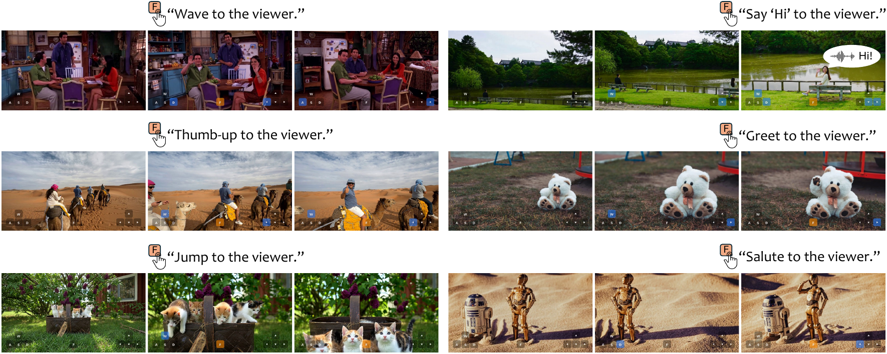
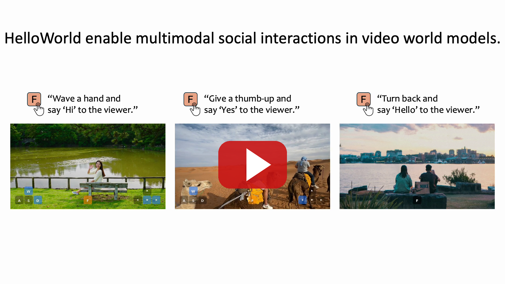

# HelloWorld: Enabling Socially Interactive Characters in Video World Models

Liangyang Ouyang<sup>1,2</sup>, Ruicong Liu<sup>2</sup>, Xuangeng Chu<sup>2</sup>, Kaipeng Zhang<sup>2</sup>, Yoichi Sato<sup>1</sup>

<sup>1</sup>The University of Tokyo &nbsp;&nbsp; <sup>2</sup>Alaya Lab



**HelloWorld** is a video world model that enables social interaction with in-world characters. With a single button press (`F`), users can prompt the on-screen character to respond toward the camera, *e.g.*, turning to the viewer, waving, nodding, or speaking a short greeting, while maintaining high-quality scene and camera-trajectory reconstruction.

- **Self-distillation training:** the base video generation model is finetuned on data synthesized by itself, containing both social interactions and camera motion, so it learns camera-pose conditioning without degrading interaction quality.
- **Training-free temporal control:** at inference, a temporal cross-attention mask localizes the character's response to the `F`-press window.
- **HelloWorldBench:** a 400-sample benchmark with three social interaction metrics (ActAcc, TimeAcc, GazeDev) alongside three conventional metrics.

## Examples

<table>
  <tr>
    <td width="50%" align="center"><h3>Warp Video Condition</h3></td>
    <td width="50%" align="center"><h3>HelloWorld Generation</h3></td>
  </tr>
  <tr>
    <td colspan="2"><em>A woman on a garden bench turns around and waves ("Hi") while the camera dollies in and orbits right:</em></td>
  </tr>
  <tr>
    <td colspan="2"></td>
  </tr>
  <tr>
    <td colspan="2"><em>Two hikers turn and raise a thumbs-up ("Good!") while the camera rides a 30° orbit:</em></td>
  </tr>
  <tr>
    <td colspan="2"></td>
  </tr>
  <tr>
    <td colspan="2"><em>A woman doing yoga presses her palms together and bows ("Namaste") during a left–right camera scan:</em></td>
  </tr>
  <tr>
    <td colspan="2"></td>
  </tr>
  <tr>
    <td colspan="2"><em>Two anime figurines come alive, raise one hand and wave ("Hello!") as the camera orbits left and pushes in:</em></td>
  </tr>
  <tr>
    <td colspan="2"></td>
  </tr>
  <tr>
    <td colspan="2"><em>A crow turns to the viewer, spreads its wings and caws while the camera orbits left:</em></td>
  </tr>
  <tr>
    <td colspan="2"></td>
  </tr>
  <tr>
    <td colspan="2"><em>A bear mascot forms a heart with its arms during a right–left camera scan:</em></td>
  </tr>
  <tr>
    <td colspan="2"></td>
  </tr>
  <tr>
    <td colspan="2"><em>A skeleton prop turns its skull and waves while the camera orbits left:</em></td>
  </tr>
  <tr>
    <td colspan="2"></td>
  </tr>
</table>

## Paper

📄 [HelloWorld.pdf](assets/HelloWorld.pdf)

## Demo Video

[](https://youtu.be/j4scl5Y7gXo)

▶️ Watch on [YouTube](https://youtu.be/j4scl5Y7gXo) &nbsp;·&nbsp; 📥 Download: [HelloWorld.mp4](assets/HelloWorld.mp4) (35 MB, 1080p)

## Code & Model

Inference code is in [`inference/`](inference) — see its [README](inference/README.md)
for environment setup (pinned requirements in [`env/`](env)), model weights, and the
full camera / interaction interface. The trained LoRA is on Hugging Face:
[`oyly/HelloWorld_V1`](https://huggingface.co/oyly/HelloWorld_V1). Ready-to-reproduce
examples (inputs + full recipes) are in [`assets/examples/`](assets/examples).

```bash
cd inference
bash run_helloworld.sh                          # single clip
INPUT=examples_batch.json bash run_batch.sh     # reproduce the bundled examples
```

## Release Schedule

- [x] Demo release
- [x] Model release
- [x] Inference code release
- [ ] Training code release
- [ ] Benchmark release

## Unofficial Reproduction

Many thanks to [ScrappyLabs](https://github.com/scrappylabsai) for independently reproducing HelloWorld and open-sourcing their trained model — see [scrappylabsai/helloworld-interactor](https://github.com/scrappylabsai/helloworld-interactor) and the released LoRA on [Hugging Face](https://huggingface.co/scrappylabsai/helloworld-interactor-lora). We are glad to see that their results align well with the paper. Our official release is in progress; in the meantime, feel free to try their model.

## Citation

```bibtex
@article{ouyang2026helloworld,
  title   = {HelloWorld: Enabling Socially Interactive Characters in Video World Models},
  author  = {Ouyang, Liangyang and Liu, Ruicong and Chu, Xuangeng and Zhang, Kaipeng and Sato, Yoichi},
  journal = {arXiv preprint arXiv:2608.05070},
  year    = {2026}
}
```

## Contact

For questions, please contact oyly@iis.u-tokyo.ac.jp or liangyang.ouyang@shanda.com.
